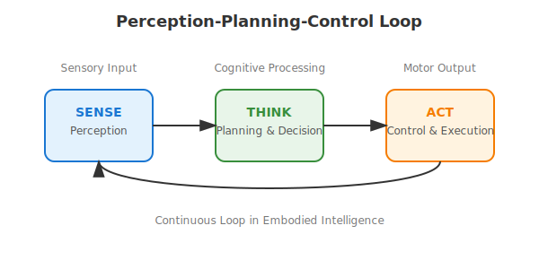

# Part 1: Perception-Planning-Control Loop

## Introduction to Embodied Cognition

Embodied cognition represents a fundamental shift in how we think about intelligence. Rather than viewing the mind as a separate entity from the body, embodied cognition suggests that our physical form and interactions with the environment are integral to how we think, learn, and make decisions. In robotics, this concept takes on special significance because it means that the design of a robot's body, its sensors, and its actuators directly influence its ability to exhibit intelligent behavior.

The relationship between body and mind in robotics is particularly important for humanoid robots, which are designed to interact with the world in ways similar to humans. A humanoid robot's physical form—including its limbs, sensors, and range of motion—shapes how it perceives and acts in its environment. This is why the design of physical systems is not just an engineering consideration, but a cognitive one as well.

Physical embodiment matters because it provides the foundation for meaningful interaction with the world. A robot that can only process information without the ability to act on it is limited in its intelligence. Similarly, a robot that can act without understanding its environment cannot exhibit sophisticated behavior. The integration of sensing, thinking, and acting creates the possibility for truly intelligent behavior.

## The SENSE Component: Perception Systems

The SENSE component of the perception-planning-control loop represents how robots gather information about their environment. This involves various types of sensors that serve different functions, much like the human sensory system.

### Types of Sensors in Humanoid Robots

Humanoid robots employ multiple types of sensors to perceive their environment:

- **Vision sensors**: Cameras and computer vision systems allow robots to "see" their environment, identifying objects, people, and obstacles.
- **Proprioceptive sensors**: These internal sensors monitor the robot's own body position, joint angles, and limb positions, providing awareness of its physical state.
- **Tactile sensors**: Located on hands, feet, or other contact points, these sensors detect touch, pressure, and force when interacting with objects.
- **Inertial measurement units (IMUs)**: These sensors detect orientation, acceleration, and angular velocity, helping the robot maintain balance and understand its movement.
- **Audio sensors**: Microphones allow robots to hear sounds, speech, and environmental audio cues.

### How Robots Perceive Their Environment

Robots process sensory information in ways that mirror some aspects of human perception, though with important differences. The robot's sensors continuously collect data about its environment and internal state. This raw data must then be processed and interpreted to extract meaningful information.

For example, a camera captures an image as a grid of pixel values, but the robot's vision system must identify objects, determine distances, and recognize patterns within that image. Similarly, proprioceptive sensors provide joint angle measurements, but the robot must integrate this information to understand its overall body configuration.

### Sensor Fusion Concepts

Sensor fusion is the process of combining information from multiple sensors to create a more complete and accurate understanding of the environment. Since no single sensor can provide complete information about the world, robots must integrate data from various sources.

For instance, a humanoid robot might use camera data to identify an object, IMU data to understand its own orientation and movement, and tactile sensors to confirm when it has successfully grasped the object. By combining these different sources of information, the robot can form a more reliable understanding of its situation than any single sensor could provide.

## The THINK Component: Planning and Decision Making

The THINK component represents the cognitive processing that occurs between sensing and acting. This involves interpreting sensory information, making decisions, and planning actions.

### How Robots Process Sensory Information

Robots process sensory information through various computational methods. The raw data from sensors is filtered, analyzed, and interpreted to extract relevant features. For example, a vision system might detect edges, colors, and shapes in an image, then combine these features to recognize objects.

This processing often involves multiple levels of abstraction. Low-level processing might detect simple features like lines or textures, while higher-level processing combines these features to recognize complex objects or situations. The robot must also maintain context and memory, connecting current sensory input with past experiences and knowledge.

### Planning Algorithms Overview

Planning in robotics involves determining a sequence of actions that will achieve a desired goal. Common approaches include:

- **Motion planning**: Algorithms that determine how to move the robot's body or limbs to achieve specific positions or trajectories
- **Path planning**: Methods for determining how to navigate from one location to another while avoiding obstacles
- **Task planning**: Higher-level planning that sequences multiple actions to achieve complex goals

Planning algorithms must consider constraints such as physical limitations of the robot, environmental obstacles, and safety requirements.

### Decision-Making Frameworks

Robots use various frameworks to make decisions:

- **Rule-based systems**: Predefined if-then rules that specify how to respond to different situations
- **State machines**: Systems that transition between different operational states based on sensory input
- **Learning-based approaches**: Systems that adapt their behavior based on experience and training data
- **Optimization methods**: Approaches that select actions based on mathematical optimization of certain criteria

## The ACT Component: Control and Execution

The ACT component represents how robots execute their plans through physical actions. This involves controlling motors, actuators, and other mechanisms to produce desired behaviors.

### Motor Control Systems

Motor control systems translate high-level plans into specific commands to the robot's actuators. These systems must handle various challenges:

- **Precision**: Ensuring that movements are executed accurately and consistently
- **Timing**: Coordinating multiple actuators to work together smoothly
- **Adaptation**: Adjusting movements in real-time based on sensory feedback
- **Safety**: Preventing movements that might damage the robot or harm humans

### Feedback and Feedforward Control

Robots use two main types of control:

- **Feedback control**: Uses sensory information to adjust actions in real-time. For example, if a robot's arm deviates from its intended path, feedback control can correct the movement.
- **Feedforward control**: Uses predictive models to anticipate how the robot should move without waiting for feedback. This is often combined with feedback control for optimal performance.

### Coordination Between Components

The ACT component must coordinate with the SENSE and THINK components to create coherent behavior. For example, when reaching for an object, the control system must:
- Use sensory feedback to adjust the movement as the hand approaches the object
- Adapt the plan if the object moves or if unexpected obstacles appear
- Execute the grasp with appropriate force based on tactile feedback

## Integration and Examples

The perception-planning-control loop works as an integrated system where each component influences the others. A real-world example of this loop in action is a humanoid robot walking:

1. **Sensing**: The robot uses its IMU to detect its balance, cameras to see the path ahead, and proprioceptive sensors to monitor its joint positions.
2. **Thinking**: The robot processes this information to plan its next steps, considering obstacles, the terrain, and its balance state.
3. **Acting**: The robot executes the planned steps, moving its legs in a coordinated pattern.
4. **Integration**: Throughout the process, the robot continuously senses its state, adjusts its plans, and modifies its actions to maintain balance and progress toward its destination.

This loop operates continuously, with each cycle building on the previous one to create stable, purposeful behavior. The integration of perception, planning, and control enables robots to operate effectively in complex, dynamic environments.

## Diagram: Perception-Planning-Control Loop

The diagram above illustrates the continuous flow of information through the perception-planning-control loop, showing how sensory input is processed into actions, which then affect the environment and generate new sensory input.