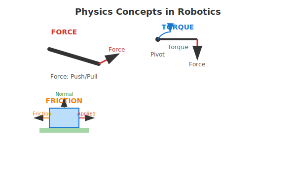

# Part 2: Physics Basics for Robotics

## Understanding Force

Force is a fundamental concept in physics that describes any interaction that can change the motion of an object. In robotics, understanding force is crucial for controlling how robots move, manipulate objects, and interact with their environment.

### Definition and Units

A force is a push or pull that acts on an object, characterized by both magnitude (how strong the force is) and direction (where the force is applied). Force is measured in Newtons (N) in the International System of Units, where 1 Newton is the force required to accelerate a 1 kilogram mass at 1 meter per second squared.

### Types of Forces in Robotics

Several types of forces are particularly relevant to robotics:

- **Gravity**: The constant downward force that affects all objects with mass. Robots must constantly work against gravity to maintain position or move upward.
- **Applied forces**: Forces that robots exert on objects when manipulating them, such as pushing, pulling, or lifting.
- **Reaction forces**: Forces that occur when a robot interacts with surfaces or objects. According to Newton's third law, for every action, there is an equal and opposite reaction.
- **Contact forces**: Forces that occur when the robot physically touches objects or surfaces, including normal forces (perpendicular to the surface) and frictional forces (parallel to the surface).

### Examples: Lifting Objects, Walking Dynamics

When a robot lifts an object, it must apply an upward force at least equal to the gravitational force acting on the object (its weight). For example, to lift a 5 kg object, the robot must apply at least 49 Newtons of force upward (5 kg × 9.8 m/s² = 49 N).

In walking dynamics, robots must manage forces carefully to maintain balance. When a bipedal robot takes a step, it shifts its center of mass and applies forces to the ground that counteract gravity and maintain stability. The robot must also manage the impact forces when the foot contacts the ground.

## Understanding Torque

Torque is the rotational equivalent of linear force. While force causes linear acceleration, torque causes angular acceleration. In robotics, torque is essential for understanding how robots rotate their joints and manipulate objects.

### Definition and Relationship to Force

Torque (τ) is calculated as the product of force (F) and the distance (r) from the pivot point to where the force is applied: τ = F × r. The unit of torque is Newton-meters (N⋅m). Torque depends not only on the magnitude of the applied force but also on the distance from the pivot point and the angle at which the force is applied.

Torque is particularly important in robotic joints. When a motor applies force to rotate a joint, the resulting torque determines how effectively the robot can move its limb. A longer limb requires more torque to move the same mass, which is why robots with longer arms often need more powerful actuators.

### Torque in Joint Actuation

In humanoid robots, each joint requires actuators (motors) that can generate sufficient torque to move the attached limbs. The torque requirements depend on several factors:

- **Load**: The weight of the limb and any additional load the robot is carrying
- **Speed**: Moving faster often requires more torque, especially during acceleration
- **Mechanical advantage**: The design of the joint and transmission system affects how the motor's torque is converted to movement

For example, when a humanoid robot raises its arm holding an object, the shoulder joint must generate enough torque to overcome both the weight of the arm and the weight of the object, multiplied by their respective distances from the joint.

### Examples: Rotating Limbs, Gripping Mechanisms

When a robot rotates its arm, the shoulder joint motor must generate sufficient torque to accelerate the arm and any object it's holding. The required torque increases with the mass of the object and how far it is from the joint.

In gripping mechanisms, torque determines how strongly a robot can grasp objects. A robotic hand's fingers apply torque to close around an object, and the amount of torque determines the grip strength. Too little torque results in dropping objects; too much torque might damage delicate items.

## Understanding Friction

Friction is the force that resists the relative motion of two surfaces in contact. While often thought of as a hindrance, friction is essential for many robotic functions, particularly for manipulation and locomotion.

### Static vs. Dynamic Friction

There are two main types of friction relevant to robotics:

- **Static friction**: The force that prevents objects from starting to move. Static friction is generally higher than dynamic friction, which is why it's harder to start pushing a heavy object than to keep it moving once it's started.
- **Dynamic (or kinetic) friction**: The force that opposes motion when two surfaces are already sliding against each other. This force typically remains constant regardless of the speed of motion.

The coefficient of friction (μ) is a dimensionless number that characterizes the friction between two materials. The frictional force is calculated as F_friction = μ × F_normal, where F_normal is the normal force pressing the surfaces together.

### Friction in Locomotion and Manipulation

Friction is crucial for robotic locomotion. Without sufficient friction between a robot's feet and the ground, the robot cannot walk effectively. The friction provides the necessary traction for pushing off the ground and maintaining balance. This is why robots can have difficulty walking on slippery surfaces.

In manipulation, friction allows robots to grip and hold objects. The friction between a robot's fingers and an object determines how securely the object can be held. Adequate friction prevents objects from slipping out of the robot's grasp.

### Managing Friction in Robot Design

Robot designers must carefully consider friction in their designs:

- **Foot design**: The material and texture of robot feet affect the friction with the ground, impacting walking stability
- **Gripper design**: The surface properties of robot fingers affect their ability to grip objects securely
- **Joint design**: Friction in joints can cause energy losses but also provides stability in some cases
- **Surface interaction**: Robots must account for varying friction properties of different surfaces they might encounter

## Practical Examples

Real-world applications of physics concepts in robotics include:

- **Robotic arms**: Must calculate and apply appropriate forces and torques to manipulate objects safely and effectively
- **Walking robots**: Must manage forces and friction to maintain balance and move efficiently
- **Mobile robots**: Must consider friction when navigating different surfaces and terrains
- **Assembly robots**: Must apply precise forces to join components without damaging them

These physics principles, while fundamental, are essential for creating robots that can interact effectively with the physical world. Understanding these concepts allows robot designers to create systems that are both capable and safe in their interactions with humans and the environment.

## Diagram: Physics Concepts in Robotics

The diagram above illustrates the fundamental physics concepts of force, torque, and friction as they apply to robotics. Each concept is visualized with simple examples showing how these forces operate in robotic systems.