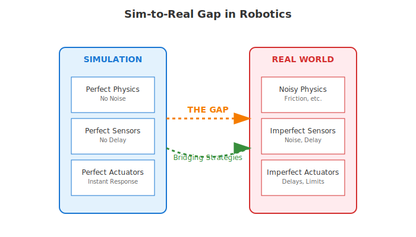

# Part 3: Humanoid Architecture & Sim-to-Real Gap

## Humanoid Robot Components

Humanoid robots are complex systems that integrate multiple subsystems to create machines capable of human-like interaction with the environment. Understanding these components and how they work together is essential for grasping how humanoid robots function.

### Sensory Systems

The sensory systems of humanoid robots serve as the equivalent of human senses, providing information about both the internal state of the robot and its external environment.

**Vision Systems**: Cameras and computer vision systems allow humanoid robots to perceive their environment visually. These systems typically include multiple cameras positioned to provide different perspectives, often including stereo vision for depth perception. Advanced humanoid robots may also include specialized vision systems such as thermal cameras or 3D depth sensors.

**Tactile Sensors**: Distributed across the robot's surface, particularly on hands and feet, tactile sensors detect touch, pressure, temperature, and texture. These sensors enable the robot to handle objects delicately and maintain balance by sensing contact with surfaces.

**Inertial Measurement Units (IMUs)**: These sensors detect the robot's orientation, acceleration, and angular velocity. Multiple IMUs are often distributed throughout the robot's body to monitor the movement and orientation of different body parts, which is crucial for maintaining balance and coordination.

**Audio Systems**: Microphones enable the robot to hear speech and environmental sounds. More advanced systems may include multiple microphones for sound localization and noise cancellation, allowing the robot to focus on specific sound sources.

### Actuation Systems

Actuation systems provide the mechanical power that enables humanoid robots to move and interact with their environment.

**Servo Motors**: These precision motors control the robot's joints, providing accurate position, velocity, and torque control. High-end humanoid robots may have dozens of servo motors controlling different joints throughout the body.

**Pneumatic Systems**: Some humanoid robots use pneumatic actuators, which provide powerful and compliant motion suitable for certain applications. These systems use compressed air to generate movement and can provide more natural, human-like motion.

**Hydraulic Systems**: For robots requiring high power-to-weight ratios, hydraulic actuators may be used. These systems provide significant force but require more complex infrastructure including pumps and fluid reservoirs.

**Linear Actuators**: These provide straight-line motion for applications such as extending limbs or adjusting the robot's height.

### Processing Units

The computational systems of humanoid robots process sensory information, execute control algorithms, and coordinate the robot's behavior.

**Central Processing Units**: High-performance computers handle the main control algorithms, planning, and decision-making processes. These systems must be powerful enough to process multiple sensor streams in real-time while executing complex control algorithms.

**Distributed Processing**: Many humanoid robots use distributed computing architectures where local processors handle specific subsystems (such as individual limbs or sensory systems) while a central system coordinates overall behavior.

**Real-time Systems**: Critical control functions often run on real-time operating systems that guarantee response times, ensuring that balance and safety functions operate without delay.

### Structural Design

The physical structure of humanoid robots must support their intended functions while providing appropriate weight distribution and durability.

**Kinematic Design**: The arrangement of joints and links determines the robot's range of motion and capabilities. Humanoid robots typically use kinematic chains that mirror human anatomy, including shoulders, elbows, wrists, hips, knees, and ankles.

**Materials**: Modern humanoid robots use lightweight, strong materials such as carbon fiber, aluminum, and advanced polymers to achieve appropriate strength-to-weight ratios while maintaining durability.

**Modularity**: Many designs incorporate modular components that can be replaced or upgraded independently, facilitating maintenance and development.

## The Sim-to-Real Gap: Challenges and Considerations

The sim-to-real gap refers to the differences between robot behavior in simulation and in the real world. This gap represents one of the most significant challenges in robotics development and affects many aspects of robot design and deployment.

### Modeling Limitations and Approximations

Simulations must make simplifying assumptions to remain computationally tractable, but these assumptions often don't hold in the real world.

**Physical Modeling**: Real-world physics includes complex phenomena that are difficult to model accurately in simulation, such as flexible body dynamics, complex contact mechanics, and subtle material properties. Simulations often use simplified models of friction, contact, and material behavior that don't capture all real-world complexities.

**Sensor Modeling**: Simulated sensors rarely capture all the imperfections and limitations of real sensors, including noise, latency, calibration errors, and environmental sensitivity. Real cameras have lens distortion, limited dynamic range, and motion blur that may not be accurately represented in simulation.

**Actuator Modeling**: Real actuators have limitations that are often not fully captured in simulation, including compliance, backlash, friction variations, and power limitations. These factors can significantly affect robot performance.

### Sensor Noise and Uncertainty

Real sensors provide noisy, uncertain information that can significantly impact robot performance compared to the clean, accurate data typically available in simulation.

**Noise Sources**: Real sensors are affected by various sources of noise including electronic noise, environmental factors, and mechanical vibrations. This noise can cause small errors that compound over time and lead to significant deviations from expected behavior.

**Uncertainty Handling**: Real robots must implement uncertainty-aware algorithms that can function despite imperfect sensor data. This often requires more sophisticated algorithms than those needed in simulation where sensor data is typically assumed to be perfect.

### Actuator Limitations and Delays

Real actuators have physical limitations that may not be fully captured in simulation.

**Power Limitations**: Real actuators have limited power and torque capabilities that may not be fully stressed in simulation. This can affect the robot's ability to perform certain tasks, especially under unexpected loads.

**Response Delays**: Real actuators have response times and delays that may not be accurately modeled in simulation. These delays can affect control performance and stability.

**Wear and Degradation**: Real actuators change their characteristics over time due to wear, temperature changes, and other factors. This can cause behavior to drift from what was validated in simulation.

### Environmental Factors and Unmodeled Dynamics

The real world contains countless factors that are difficult to model in simulation.

**Environmental Variations**: Real environments vary in ways that are difficult to capture in simulation, including lighting conditions, surface properties, temperature, and humidity.

**Unmodeled Objects**: The real world contains objects and obstacles that weren't considered during simulation, requiring robots to be robust to unexpected situations.

**Dynamic Environments**: Real environments often contain moving objects, changing conditions, and other dynamic elements that are challenging to model comprehensively.

## Bridging the Gap

Several strategies are employed to address the sim-to-real gap and improve the transfer of robot behaviors from simulation to reality.

### Robust Control Strategies

Developing control strategies that are robust to modeling errors and environmental variations is crucial for successful sim-to-real transfer.

**Robust Control**: Control algorithms designed to maintain performance despite uncertainties and modeling errors. These systems often sacrifice optimal performance in simulation to achieve reliable performance in reality.

**Adaptive Control**: Systems that can adjust their behavior based on real-world experience, learning to compensate for modeling errors and environmental changes.

**Learning-based Approaches**: Machine learning techniques that can learn directly from real-world experience or that are specifically designed to handle the sim-to-real transfer problem.

### System Identification and Parameter Tuning

Techniques for identifying and adjusting model parameters based on real-world data.

**Parameter Estimation**: Methods for determining the actual values of physical parameters (such as mass, friction coefficients, and actuator characteristics) through real-world experiments.

**Calibration**: Systematic procedures for adjusting simulation models to better match real-world behavior.

**Online Learning**: Algorithms that continuously update model parameters based on real-world performance data.

### Validation and Testing Approaches

Comprehensive testing strategies that evaluate robot performance across multiple levels of realism.

**Progressive Testing**: Gradually increasing the complexity and realism of testing environments, starting from simple simulations and progressing to full real-world testing.

**Domain Randomization**: Techniques that randomize simulation parameters to train controllers that are robust to variations between simulation and reality.

**Systematic Validation**: Structured approaches to validating robot performance that include both simulation and real-world testing with clear criteria for success.

## Diagram: Sim-to-Real Gap in Robotics

The diagram above contrasts the idealized world of simulation with the complexities of the real world, highlighting the key differences that create the sim-to-real gap. It also shows strategies for bridging this gap to improve robot performance in real-world applications.