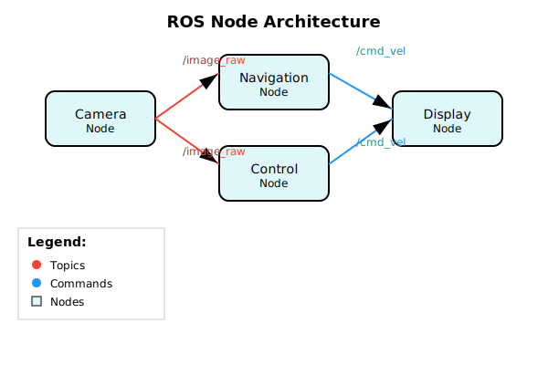

# Part 1: ROS Nodes - The Building Blocks of Your Robot's Nervous System

## Introduction to ROS Nodes

Welcome to the fascinating world of the Robotic Operating System (ROS)! If you're new to robotics, think of ROS not as an actual operating system like Windows or Linux, but as a flexible framework for writing robot software. It's a collection of tools, libraries, and conventions that aim to simplify the task of creating complex and robust robot behavior across a wide variety of robot platforms.

At the heart of ROS lies the concept of **nodes**. A ROS node is essentially a process (a program) that performs computation. In the context of a humanoid robot, you might have nodes controlling the arms, nodes processing camera data, nodes handling speech recognition, and nodes managing the robot's walking gait. All of these nodes work together to create the robot's overall behavior.

ROS was originally developed by Stanford University's AI Lab and later maintained by Willow Garage, a robotics research institute. Since then, it has evolved into the de facto standard for robotics research and development, with ROS 2 being the current generation that addresses the limitations of the original ROS, particularly in areas of security, real-time performance, and multi-robot systems.

### What Makes a Node Special?

Unlike regular computer programs, ROS nodes are designed to work together in a distributed system. They can run on the same computer or across multiple computers connected via a network. This means that one computer might handle the robot's vision processing while another handles motion planning, yet they can communicate seamlessly as if they were one program.

Think of nodes like different organs in your body - your brain, heart, lungs, and muscles each perform specific functions, but they all communicate and work together to keep you functioning. Similarly, each ROS node has a specific job, but they all work together to make your robot function as a complete system.

This distributed architecture provides several advantages:

1. **Fault Tolerance**: If one node fails, others can continue operating
2. **Scalability**: You can add more computational resources as needed
3. **Modularity**: Nodes can be developed, tested, and maintained independently
4. **Flexibility**: Nodes can be reused across different robot platforms

## The Anatomy of a ROS Node

Every ROS node follows a basic structure that includes:

1. **Initialization**: The node declares itself to the ROS system and gives itself a unique name
2. **Setup**: The node creates publishers, subscribers, services, or other communication interfaces
3. **Main Loop**: The node performs its specific task, often in a continuous loop
4. **Shutdown**: The node properly cleans up resources when it's time to stop

### Node Architecture Components

A typical ROS node consists of several key components:

- **Node Handle**: The interface between your node and the ROS system
- **Publishers**: Interfaces for sending messages to topics
- **Subscribers**: Interfaces for receiving messages from topics
- **Services**: Interfaces for providing request/response functionality
- **Action Servers/Clients**: Interfaces for long-running tasks with feedback
- **Parameters**: Configuration values that can be set externally
- **Timers**: For executing code at regular intervals
- **Callbacks**: Functions that handle incoming messages

### Node Structure Overview

Every ROS node follows a basic structure that includes initialization, setup of communication interfaces, main execution loop, and proper shutdown. The structure ensures that nodes can integrate seamlessly into the ROS ecosystem.

### Node Creation Process

When you create a ROS node, several things happen behind the scenes:

1. **Node Registration**: The node registers itself with the ROS master (in ROS 1) or with the DDS (Data Distribution Service) network in ROS 2
2. **Unique Identification**: The node receives a unique identifier within the ROS system
3. **Communication Setup**: Publishers and subscribers are created and registered
4. **Parameter Loading**: Any node-specific parameters are loaded
5. **Execution Loop**: The node enters its main execution loop or waits for callbacks

## Node Communication: The Foundation of Robot Systems

ROS nodes don't work in isolation. They communicate with each other through three main mechanisms:

1. **Topics** - for continuous data streams (like sensor data)
2. **Services** - for request/response interactions (like asking for a calculation)
3. **Actions** - for goal-oriented tasks that take time (like navigating to a location)

We'll explore these communication methods in detail in Parts 2 and 3 of this chapter.

### The Importance of Decoupled Communication

One of the key design principles of ROS is that nodes are decoupled from each other. This means:

- Publishers don't know who subscribes to their topics
- Subscribers don't know which publisher sent the message
- Nodes can be started and stopped independently
- Multiple nodes can publish to the same topic
- Multiple nodes can subscribe to the same topic

This decoupling provides flexibility and robustness to robot systems, allowing components to be developed and tested independently.

## Real-World Example: TurtleBot3 Node Architecture

Let's look at how nodes work in a real humanoid robot system. The TurtleBot3 is a popular educational robot that demonstrates ROS concepts effectively:

- **Navigation Node**: Handles path planning and obstacle avoidance
- **Camera Node**: Processes visual information from the robot's camera
- **Motor Controller Node**: Manages the robot's wheel movements
- **Lidar Node**: Processes distance measurements from laser sensors
- **Joint State Publisher Node**: Tracks and shares the position of robot joints
- **Robot State Publisher Node**: Computes and publishes coordinate transforms
- **IMU Node**: Processes inertial measurement unit data
- **Battery Monitor Node**: Tracks and reports battery status

All of these nodes work together to enable the TurtleBot3 to move around, avoid obstacles, and respond to commands.

### TurtleBot3 Node Communication Example

In the TurtleBot3 system, when the robot needs to navigate to a goal:

1. The navigation node receives the goal via a service call
2. It uses sensor data from the lidar and IMU nodes
3. It calculates a path and sends velocity commands to the motor controller
4. It continuously monitors progress using feedback from various sensors
5. When the goal is reached, it reports completion

This entire process involves multiple nodes working together without any single node having complete knowledge of the entire system.

## Node Lifecycle and Management

ROS nodes go through several states during their lifetime:

1. **Unconfigured**: The node exists but isn't fully initialized
2. **Inactive**: The node is configured but not actively running
3. **Active**: The node is running and performing its tasks
4. **Finalized**: The node has been shut down and cleaned up

This lifecycle management is important for complex robot systems where you might want to start, stop, or restart specific components without affecting the entire system.

### Lifecycle Node Benefits

Lifecycle nodes provide several advantages:

- **Graceful Startup**: Nodes can initialize resources in a controlled manner
- **Health Monitoring**: The system can track the health of individual components
- **Dynamic Reconfiguration**: Nodes can be reconfigured during runtime
- **Coordinated Shutdown**: Nodes can clean up resources properly when stopping

## Creating Your First Node

To create a ROS node, you need to:

1. Choose a unique name for your node
2. Decide what the node will do (its specific function)
3. Determine what information it needs to receive and send
4. Implement the node using your chosen programming language (Python, C++, etc.)

### Node Development Best Practices

When creating ROS nodes, consider these best practices:

- **Single Responsibility**: Each node should have one clear purpose
- **Error Handling**: Implement proper error handling and recovery mechanisms
- **Logging**: Use ROS logging for debugging and monitoring
- **Parameters**: Use ROS parameters for configuration
- **Namespacing**: Use appropriate namespaces for topics and services
- **Documentation**: Document your node's interfaces clearly
- **Testing**: Create unit tests for your node's functionality

## Node Tools and Utilities

ROS provides several tools to help you work with nodes:

- **`ros2 node list`**: Shows all active nodes in the system
- **`ros2 node info <node_name>`**: Shows information about a specific node
- **`ros2 run <package_name> <executable>`**: Runs a node from a package
- **`ros2 lifecycle`**: Manages lifecycle nodes
- **RViz**: Visualizes node behavior and robot state
- **rqt_graph**: Shows the connections between nodes

## Summary

ROS nodes are the fundamental building blocks of any ROS-based robot system. They're independent processes that perform specific tasks and communicate with each other to create complex robot behaviors. Understanding nodes is crucial for developing humanoid robots because they allow you to break down complex robot behaviors into manageable, reusable components.

The distributed architecture of ROS nodes provides fault tolerance, scalability, modularity, and flexibility that are essential for complex humanoid robot systems. Each node has a specific responsibility, communicates through well-defined interfaces, and can be developed, tested, and maintained independently.

In the next section, we'll explore how these nodes communicate with each other using ROS's powerful communication patterns, including topics, services, and actions.