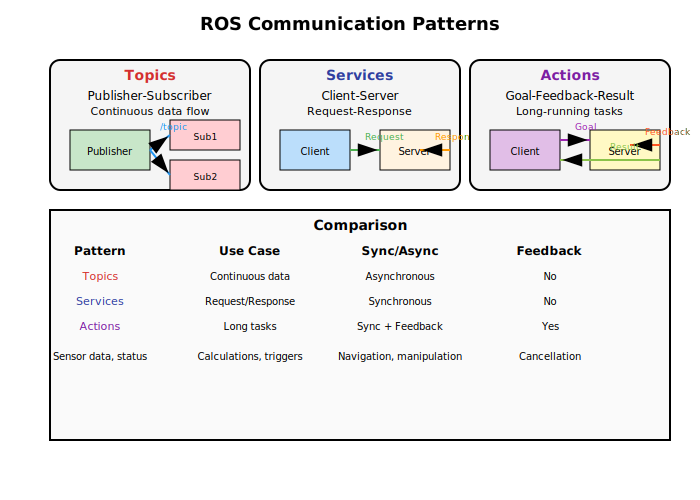

# Part 2: ROS Communication Patterns - Topics, Services, and Actions

## Introduction to ROS Communication

In the first part of this chapter, we learned that ROS nodes are like different organs in a robot's body - each with its own function but all working together. But just like organs in your body need to communicate (your brain tells your muscles to move, your eyes send visual information to your brain), ROS nodes need to communicate with each other to work as a cohesive system.

ROS provides three distinct communication patterns, each designed for different types of interactions: **Topics** for continuous data streams, **Services** for request-response interactions, and **Actions** for goal-oriented tasks that take time to complete. Understanding these communication patterns is essential because they form the backbone of how information flows through your robot system.

### The Importance of Communication in Robotics

Communication in robotics is fundamentally different from traditional software applications. In robotics, you're dealing with:

- **Real-time constraints**: Robot systems often need to respond to sensor data within milliseconds
- **Multiple data types**: From simple integers to complex sensor arrays and images
- **Distributed processing**: Different computational tasks running on different hardware
- **Safety considerations**: Incorrect communication can lead to robot malfunctions or safety issues
- **Synchronization challenges**: Coordinating multiple processes happening simultaneously

## Topics: The Publisher-Subscriber Pattern

Topics are the most common way that nodes communicate in ROS. They follow a **publisher-subscriber** pattern, which is like a radio broadcast system:

- **Publishers** send data (like a radio station broadcasting music)
- **Subscribers** receive data (like people listening to the radio)
- Multiple subscribers can listen to the same topic simultaneously
- Publishers don't know who is listening (anonymous communication)

### How Topics Work

Imagine your robot has a camera node that continuously captures images. This camera node would **publish** images to a topic called `/camera/image_raw`. Meanwhile, other nodes like an object detection node, a face recognition node, and a navigation node might all **subscribe** to this same topic to receive the camera images simultaneously.

The beauty of this system is that the camera node doesn't need to know about all the other nodes - it just publishes its data and any interested nodes can subscribe to receive it. This makes the system very flexible and modular.

### Quality of Service (QoS) in Topics

ROS 2 introduces Quality of Service (QoS) settings that allow you to control how messages are delivered:

- **Reliability**: Whether messages must be delivered (reliable) or can be dropped (best effort)
- **Durability**: Whether late-joining subscribers get old messages (transient local) or only new ones (volatile)
- **History**: How many messages to keep in the queue
- **Deadline**: How long a message is considered valid

### Topic Example in Python (rclpy)

A publisher node in ROS follows a standard pattern of creating a publisher interface, setting up a timer for periodic publishing, and implementing the publishing logic. The publisher creates messages and sends them to a specific topic that other nodes can subscribe to.

A subscriber node follows a complementary pattern of creating a subscription interface and defining a callback function that gets executed whenever a new message arrives on the topic.

The subscriber node implements a callback function that processes incoming messages from the topic. The callback is executed automatically whenever a new message arrives, allowing the node to react to data in real-time.

### Advanced Topic Concepts

**Message Filters**: ROS provides message filters that help you synchronize multiple topics. For example, if you need to process camera images and laser data together, you can use message filters to ensure they're synchronized in time.

**Topic Remapping**: You can remap topic names at runtime, allowing the same node to work with different topic names without code changes.

**Namespacing**: Topics can be organized using namespaces to avoid naming conflicts in complex systems.

## Services: Request-Response Communication

While topics are great for continuous data streams, sometimes you need a more direct form of communication - like asking a question and getting an answer back. This is where **services** come in.

Services follow a **client-server** pattern:
- A **service client** sends a request and waits for a response
- A **service server** receives the request, processes it, and sends back a response
- This is synchronous (the client waits for the response)

### When to Use Services

Services are perfect for tasks like:
- Asking for a map of the environment
- Requesting a path from point A to point B
- Saving robot configuration data
- Triggering a specific action that returns a result
- Getting the current robot state
- Performing calculations that require a definitive answer

### Service Architecture

Services in ROS use a request-response model where:
1. The service server defines the service interface (request and response message types)
2. The client sends a request message to the service
3. The server processes the request and sends back a response message
4. The client receives the response and continues processing

### Service Example

A service server implements a specific function that other nodes can request. The server defines the service interface and handles incoming requests, processing them and returning appropriate responses.

A service client sends requests to the service server and waits for the response, following a synchronous request-response pattern.

The service client establishes a connection to the service server, prepares the request with the necessary parameters, and then waits for the server to process the request and return a response.

### Service Best Practices

- **Keep services fast**: Services block the client, so keep processing time minimal
- **Handle errors gracefully**: Return appropriate error codes in responses
- **Use appropriate data types**: Choose message types that efficiently represent your data
- **Consider alternatives**: For high-frequency requests, consider using topics instead

## Actions: Long-Running Tasks with Feedback

Actions are used for tasks that take a significant amount of time to complete and may need to provide feedback during execution. Think of actions as services that can tell you how they're progressing.

### Action Components

An action has three parts:
1. **Goal**: What you want the action to do
2. **Feedback**: Updates on how the action is progressing
3. **Result**: What happened when the action completed

### When to Use Actions

Actions are ideal for:
- Moving the robot to a specific location (navigation)
- Moving robot joints to specific positions (arm control)
- Performing complex manipulations that take time
- Any task that might need to be canceled or monitored
- Tasks with intermediate states that need to be communicated
- Operations that could fail partway through

### Action Architecture

Actions follow a more complex pattern than services:
1. The action client sends a goal to the action server
2. The server accepts the goal and begins processing
3. The server periodically sends feedback messages about progress
4. The client can send cancellation requests
5. When complete, the server sends a result message

### Action Example: Robot Navigation

When you want your robot to navigate to a specific location, you would send a **goal** to a navigation action server. As the robot moves, it would send **feedback** about its progress (like "50% to destination"). When it arrives, it would send a **result** indicating success or failure.

### Action Implementation Example

An action client implements the process of sending goals to an action server, waiting for the server to accept the goal, and then monitoring progress through feedback messages. The client can also handle the final result when the action completes or is canceled.

## Comparison of Communication Patterns

| Pattern | Use Case | Synchronization | Multiple Senders/Receivers | Feedback | Cancellation |
|---------|----------|-----------------|---------------------------|----------|--------------|
| Topics | Continuous data (sensors, status) | Asynchronous | Multiple publishers/subscribers | No | No |
| Services | Request/response (calculations, triggers) | Synchronous | One server, multiple clients | No | No |
| Actions | Long tasks with progress (navigation) | Synchronous with feedback | One server, multiple clients | Yes | Yes |

## Real-World Example: NAO Humanoid Robot Communication

Let's examine how these communication patterns work in the NAO humanoid robot:

- **Topics**: Joint sensors publish position data to `/joint_states`, which is subscribed by the control system and visualization tools. Camera data is published to image topics for vision processing nodes.
- **Services**: The speech system provides a `/say_text` service that other nodes can call to make the robot speak. The motion system provides services for immediate joint commands.
- **Actions**: The motion system provides `/move_to` actions that allow other nodes to request the robot to move to specific positions with feedback on progress. The audio system uses actions for speech recognition that takes time to process.

This combination allows the NAO robot to coordinate its complex behaviors effectively, with different subsystems communicating in the most appropriate way for their specific needs.

### NAO Communication Flow Example

In a typical NAO interaction:

1. Vision nodes publish face detection data via topics
2. When a face is detected, a behavior manager node sends an action goal to move the head to track the face
3. The head controller provides feedback on tracking progress
4. Simultaneously, the speech system might use a service to make the robot say "Hello"
5. All these communications happen simultaneously without direct dependencies

## Message Types and Data Structures

ROS comes with a rich set of predefined message types in packages like `std_msgs`, `sensor_msgs`, `geometry_msgs`, and `nav_msgs`. These include:

- **std_msgs**: Basic data types (integers, floats, strings, boolean values)
- **sensor_msgs**: Sensor data (images, laser scans, IMU data)
- **geometry_msgs**: Geometric primitives (points, poses, transforms)
- **nav_msgs**: Navigation-specific messages (paths, occupancy grids)

You can also define your own custom message types by creating `.msg` files in your ROS package.

## Communication Performance Considerations

When designing your robot's communication architecture, consider:

- **Bandwidth**: High-resolution sensor data can consume significant network bandwidth
- **Latency**: Some applications require very low communication latency
- **Reliability**: Mission-critical applications need guaranteed message delivery
- **Synchronization**: Multiple sensors may need to be synchronized in time
- **Resource usage**: Communication overhead can impact overall system performance

## Troubleshooting Communication Issues

Common communication problems and solutions:

- **Topic not receiving data**: Check if the publisher is running and topic names match
- **Service calls failing**: Verify the service server is running and available
- **Action timeouts**: Check if the action server is properly handling goals
- **Message type mismatches**: Ensure publishers and subscribers use the same message types
- **Network issues**: Verify network connectivity in distributed systems

## Choosing the Right Communication Pattern

When designing your robot system, choose your communication pattern based on:

- **Use Topics** when you need continuous data flow or when multiple nodes need the same information simultaneously
- **Use Services** when you need a specific result from a computation or action
- **Use Actions** when you need to perform a task that takes time and may need monitoring or cancellation

Consider also the frequency of communication, the criticality of the data, and whether intermediate feedback is needed.

## Summary

ROS communication patterns form the nervous system of your robot, allowing different nodes to share information and coordinate activities. Topics provide continuous data streams, services offer request-response interactions, and actions handle long-running tasks with feedback. Understanding when and how to use each pattern is essential for building effective humanoid robot systems.

The choice of communication pattern significantly impacts your robot's performance, reliability, and maintainability. Each pattern has its place in the robot's architecture, and complex systems typically use all three patterns in combination.

In the next section, we'll explore URDF (Unified Robot Description Format) and how to implement these communication patterns in Python using rclpy.