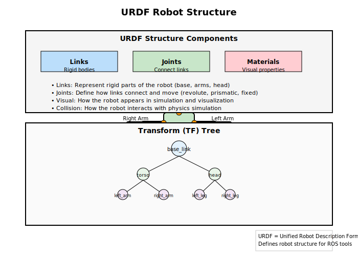

# Part 3: URDF Basics and Python Communication with rclpy

## Introduction to URDF (Unified Robot Description Format)

URDF stands for Unified Robot Description Format, and it's one of the most important concepts in ROS for humanoid robotics. Think of URDF as the "DNA" of your robot - it describes what your robot looks like, how its parts are connected, and how it moves. URDF is an XML-based format that allows you to define your robot's physical structure in a way that ROS tools and algorithms can understand.

For humanoid robots, URDF is especially crucial because these robots have complex kinematic structures with multiple limbs, joints, and sensors. Without a proper URDF description, ROS wouldn't know how to control the robot's movements or interpret sensor data correctly.

URDF is not just a visualization tool - it's a fundamental component that enables various ROS functionalities including:

- **Forward Kinematics**: Calculating where each part of the robot is in space
- **Inverse Kinematics**: Determining how to move joints to achieve a desired position
- **Collision Detection**: Preventing the robot from colliding with itself or obstacles
- **Physics Simulation**: Simulating how the robot behaves in different environments
- **Motion Planning**: Planning paths that avoid self-collisions and reach desired goals

## Understanding URDF Structure

A URDF file describes a robot using two main concepts:

1. **Links**: These represent the rigid parts of the robot (like the torso, arms, legs)
2. **Joints**: These connect the links together and define how they can move relative to each other

### Basic URDF Components

Here's a simple example of what a URDF file looks like:

```xml
<?xml version="1.0"?>
<robot name="simple_humanoid">
  <!-- Base link -->
  <link name="base_link">
    <visual>
      <geometry>
        <box size="0.5 0.2 0.1"/>
      </geometry>
    </visual>
    <collision>
      <geometry>
        <box size="0.5 0.2 0.1"/>
      </geometry>
    </collision>
    <inertial>
      <mass value="1.0"/>
      <inertia ixx="1.0" ixy="0.0" ixz="0.0" iyy="1.0" iyz="0.0" izz="1.0"/>
    </inertial>
  </link>

  <!-- Head link -->
  <link name="head">
    <visual>
      <geometry>
        <sphere radius="0.1"/>
      </geometry>
    </visual>
  </link>

  <!-- Joint connecting base to head -->
  <joint name="neck_joint" type="revolute">
    <parent link="base_link"/>
    <child link="head"/>
    <origin xyz="0 0 0.3" rpy="0 0 0"/>
    <axis xyz="0 1 0"/>
    <limit lower="-1.57" upper="1.57" effort="100" velocity="1"/>
  </joint>
</robot>
```

### Key URDF Elements

- **`<link>`**: Represents a rigid body with visual, collision, and inertial properties
- **`<joint>`**: Defines how two links connect and move relative to each other
- **`<visual>`**: How the link appears in visualization tools
- **`<collision>`**: How the link interacts with physics simulation
- **`<inertial>`**: Physical properties like mass and center of mass
- **`<material>`**: Color and texture properties for visualization
- **`<gazebo>`**: Simulation-specific properties (though we're avoiding simulation tools per requirements)

### Visual vs. Collision Properties

It's important to understand the difference between visual and collision properties:

- **Visual properties** are used for displaying the robot in visualization tools like RViz
- **Collision properties** are used for physics simulation and collision detection
- These can be the same shape (like a box) or different (like a detailed visual mesh with a simpler collision box)

## Joint Types in URDF

URDF supports several types of joints, each defining different ways links can move:

1. **Fixed**: No movement between links (like welding them together)
2. **Revolute**: Rotational movement around an axis (like a hinge)
3. **Continuous**: Like revolute but can rotate infinitely
4. **Prismatic**: Linear sliding movement along an axis
5. **Floating**: 6 degrees of freedom (rarely used)
6. **Planar**: Movement in a plane (rarely used)

For humanoid robots, revolute and continuous joints are most common, representing the various joints in arms, legs, and necks.

### Joint Limits and Dynamics

Joints can have various properties that define their behavior:

- **Limits**: Define the range of motion for revolute and prismatic joints
- **Dynamics**: Define friction and damping properties
- **Calibration**: Define the zero position of the joint
- **Safety controllers**: Define limits to protect the hardware

Example of a joint with detailed properties:

```xml
<joint name="elbow_joint" type="revolute">
  <parent link="upper_arm"/>
  <child link="lower_arm"/>
  <origin xyz="0 0 -0.3" rpy="0 0 0"/>
  <axis xyz="0 1 0"/>
  <limit lower="-2.0" upper="1.5" effort="50" velocity="2"/>
  <dynamics friction="0.1" damping="0.5"/>
</joint>
```

## URDF in Real Humanoid Robots

### TurtleBot3 URDF Example

The TurtleBot3 uses URDF to describe its structure. Its URDF file defines:

- A base link representing the main robot body
- Wheel links connected by continuous joints for rotation
- A camera link for the RGB-D sensor
- Proper inertial properties for physics simulation
- Visual meshes that show how the robot looks
- Proper transforms between different coordinate frames

### NAO Robot URDF Features

The NAO humanoid robot's URDF is more complex, defining:

- Multiple links for each limb (upper arm, lower arm, hand)
- Joints for each degree of freedom in the robot
- Sensor placements for cameras, IMUs, and other sensors
- Proper kinematic chains for forward and inverse kinematics
- Detailed visual and collision models for each body part

### URDF Best Practices

When creating URDF files:

1. **Start Simple**: Begin with a basic skeleton and add complexity gradually
2. **Use Proper Inertial Properties**: Realistic mass and inertia help with simulation and control
3. **Validate Your URDF**: Use tools like `check_urdf` to find errors
4. **Use Xacro**: For complex robots, use Xacro (XML Macros) to avoid repetition
5. **Test with Visualization**: Always verify your URDF looks correct in RViz

## Working with URDF in ROS

ROS provides several tools for working with URDF:

1. **`robot_state_publisher`**: Takes joint positions and publishes transforms for visualization
2. **RViz**: 3D visualization tool that displays URDF models
3. **`tf2`**: Transform library that uses URDF to understand relationships between links
4. **`urdf_parser`**: Library for parsing and working with URDF files programmatically
5. **`joint_state_publisher`**: Publishes joint states for visualization purposes

### The Robot State Publisher

The `robot_state_publisher` node is crucial for URDF functionality. It:

- Subscribes to joint state messages
- Calculates the position of each link based on the URDF kinematic chain
- Publishes the resulting transforms to the tf2 system
- Allows other nodes to query the robot's current configuration

## Python Communication with rclpy

Now that we understand how robots are described, let's look at how to implement ROS communication in Python using rclpy, the Python client library for ROS 2.

### Understanding rclpy Architecture

rclpy is built on top of the ROS Client Library (rcl) and provides:

- **Node abstraction**: The basic execution unit in ROS
- **Communication interfaces**: Publishers, subscribers, services, actions
- **Parameter system**: Configuration management
- **Timer functionality**: Periodic execution
- **Logging**: Standardized logging across the system
- **Time management**: ROS-specific time handling

### Setting Up Your Python Environment

Before writing ROS 2 Python nodes, you need to set up your environment:

```bash
# Source ROS 2 environment
source /opt/ros/humble/setup.bash

# Create a workspace directory
mkdir -p ~/ros2_ws/src
cd ~/ros2_ws

# Build your workspace
colcon build
source install/setup.bash
```

### Creating a Publisher Node in Python

A publisher node in ROS follows a standard pattern of initializing the node, creating a publisher interface for a specific message type, setting up a timer for periodic publishing, and implementing the publishing logic. The publisher creates messages with appropriate data and sends them to a specific topic that other nodes can subscribe to.

### Creating a Subscriber Node in Python

A subscriber node follows a complementary pattern of initializing the node, creating a subscription interface for a specific topic, and defining a callback function that gets executed whenever a new message arrives on the topic. The callback processes the incoming message data and performs the necessary actions based on the received information.

### Advanced Publisher Features

Advanced publishers can incorporate Quality of Service (QoS) settings to control message delivery characteristics such as reliability, durability, and history. They can also declare parameters that can be configured externally, allowing for runtime customization of the publisher's behavior without modifying the code.

## Creating Services in Python

A service server implements a specific function that other nodes can request. The server defines the service interface and handles incoming requests, processing them and returning appropriate responses.

### Creating a Service Client

A service client establishes a connection to the service server, prepares the request with the necessary parameters, and then waits for the server to process the request and return a response. The client must wait for the service to become available before making requests.

## Creating Actions in Python

An action server implements the processing logic for long-running tasks that provide feedback during execution. The server receives goals from clients, processes them, periodically sends feedback about progress, and finally returns a result when the task is complete or canceled.

### Creating an Action Client

An action client implements the process of sending goals to an action server, waiting for the server to accept the goal, and then monitoring progress through feedback messages. The client can also handle the final result when the action completes or is canceled.

## Advanced rclpy Concepts

### Parameters

ROS 2 provides a parameter system that allows runtime configuration. Nodes can declare parameters with default values, access parameter values during execution, and implement callbacks to handle dynamic parameter changes during runtime.

### Timers and Callbacks

Timers allow you to execute code at regular intervals. Nodes can create timers with different periods to perform periodic tasks, such as publishing sensor data, updating robot state, or performing regular maintenance operations.

## Best Practices for Python ROS Development

1. **Always handle exceptions**: Use try/except blocks around ROS operations
2. **Proper node cleanup**: Ensure nodes are properly destroyed when exiting
3. **Use appropriate QoS settings**: Quality of Service settings affect message delivery
4. **Follow naming conventions**: Use consistent naming for topics, services, and actions
5. **Document your interfaces**: Clearly document what topics your node publishes/subscribes to
6. **Test incrementally**: Test each component separately before integrating
7. **Use logging appropriately**: Use different log levels (debug, info, warn, error) appropriately
8. **Validate inputs**: Always validate data received from other nodes
9. **Handle node lifecycle**: Properly handle node startup and shutdown
10. **Use type hints**: For better code maintainability and IDE support

### Error Handling Example

Robust ROS nodes should implement proper error handling to validate incoming messages and gracefully handle exceptions. This includes checking message structure, validating data ranges, and implementing try-catch blocks around critical operations to prevent node crashes.

## Connecting URDF with Python Code

In real humanoid robot applications, you'll often need to work with both URDF descriptions and Python code together. Here's how they connect:

1. **Robot State Publisher**: Takes joint positions from your Python nodes and publishes transforms based on the URDF
2. **TF2**: Allows your Python nodes to query the robot's current configuration using transforms from the URDF
3. **Motion Planning**: Uses URDF kinematic chains to plan movements that avoid self-collisions
4. **Sensor Processing**: Uses URDF to understand where sensors are positioned on the robot

TF2 (Transform Library) is used to manage coordinate transformations between different reference frames in a robot system. It allows nodes to query the spatial relationship between different parts of the robot or between the robot and objects in its environment.

## Summary

In this chapter, we've covered the fundamental concepts of ROS that form the "nervous system" of humanoid robots:

- **ROS Nodes**: The building blocks that perform specific functions
- **Communication Patterns**: Topics for continuous data, services for request-response, and actions for long-running tasks
- **URDF**: The format for describing robot structure and kinematics
- **rclpy**: The Python interface for creating ROS nodes and communication

These concepts work together to create the distributed, modular architecture that makes ROS so powerful for humanoid robotics. Understanding these fundamentals will enable you to build complex robot behaviors by combining simple, focused nodes that communicate through well-defined interfaces.

URDF provides the structural foundation that allows ROS tools to understand your robot's physical configuration, while rclpy provides the Python interface to implement the robot's behaviors and communication. Together, they form the backbone of any humanoid robot system built with ROS.



With this foundation, you're ready to explore more advanced topics in humanoid robotics, including navigation, manipulation, perception, and learning. The combination of proper robot description (URDF) and effective communication (rclpy) provides the essential infrastructure for building sophisticated humanoid robots.